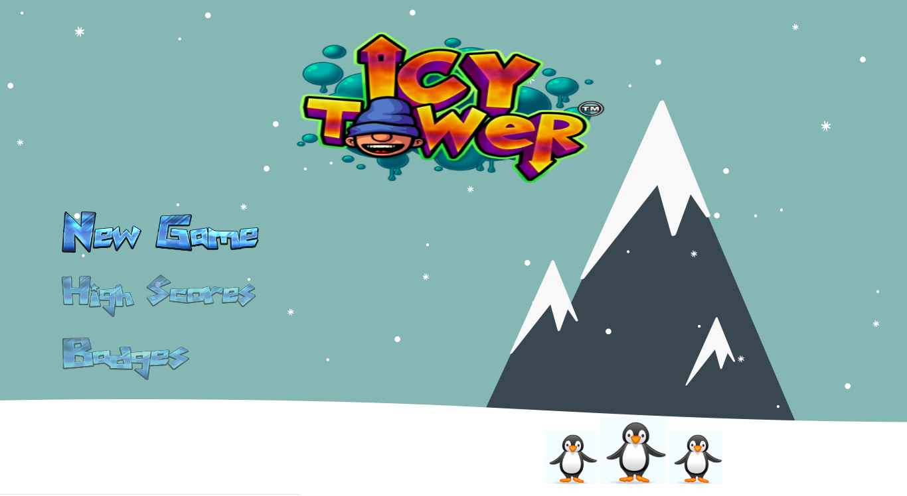
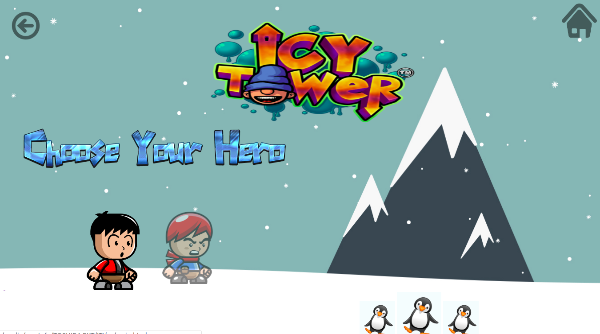
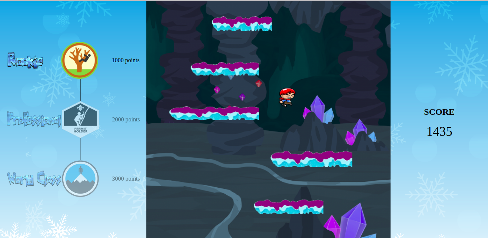
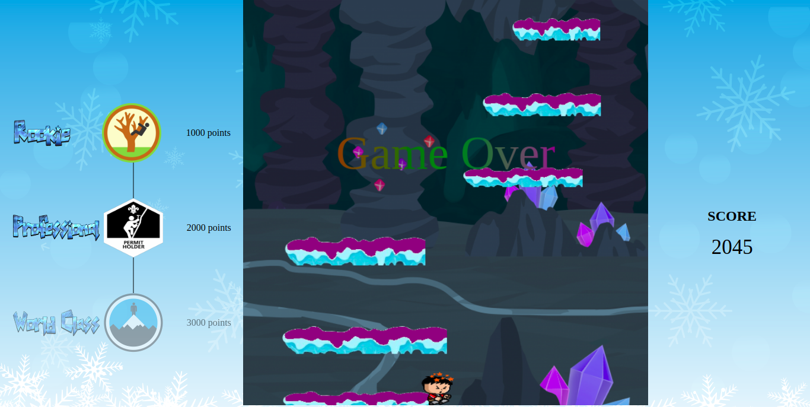

# IcyTower
Icy Tower - ITI - javaScript Project

Icy tower game is a platform game set in a tower,
 where the player's goal is to jump from one "floor" to the next and go as high as possible without falling and plunging off the screen.
 The higher the player's character climbs, the harder the game becomes by vibrating tower's floors in the second level and having the floors falling after time in the third level.
 By default, the player controls the character using a keyboard arrows.

